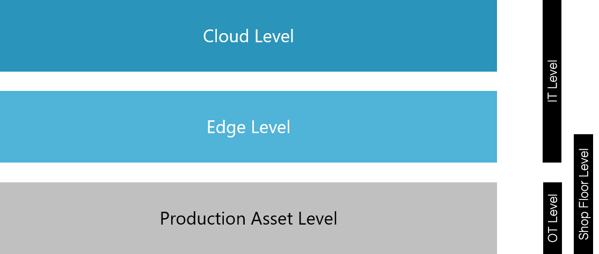

 

# IoT Connectivity Working Group

Welcome, this is the OMP IoT Connectivity Group. 
Device Integration and Connectivity is one of the first steps to digitize production lines and leverage cloud connected Industrial IoT applications as well as SCADA and MES solutions. Today, it is all about “real time”-visualization, analytics and predictions but without data no analytics and without connectivity no data.

## Group Focus
Connecting IoT devices and machines to the cloud is a fundamental requirement for systematic and continuous access, bundling and processing of data from the shop floor. It enables the use of cloud-connected industrial IoT applications.  Modern IoT devices and machines can be connected via the OPC Unified Architecture (OPC UA) while special challenges occur for historically developed legacy systems with their various standards and interfaces. The working group IoT Connectivity defines and develops industrial-grade integration solutions for green and brownfield equipment based on a modern edge and cloud approach.  The goal is a seamless integration of new production equipment independent of its intended use and technical characteristics.

## Goals of Working Group
- Create a community for understanding device connectivity use cases and implementations
- Provide guidance processes for technical decisions
- Development of common connectivity modules
- Definition and integration of industrial ready Plug&Produce patterns for greenfields & brownfields
- Speed up registration, provisioning and comissioning of IoT devices by providing standards
- Reducing the TCO by applying standards
- Build common implementation standards

## Insights Into Connecting Industrial IoT Assets
### A white paper authored by the IoT Connectivity Working Group

The IoT Connectivity Working Group presents a consensus view of the connectivity challenges and best practices in IIoT as the 4th industrial revolution unfolds. This paper is the initial publication laying out an approach to solving connectivity challenges while providing a roadmap for future OMP work. 

* [GitHub Version](White_Paper/01_Insights_Into_Connecting_Industrial_IoT_Assets/00_Acknowledgements.md)
* [Download from Website](https://open-manufacturing.org/blog/2020/12/09/industrial-iot-white-paper/)

### Table of Content

1. Manufacturing at an Inflection Point
2. Breadth and Depth
3. Principles for a Successful Connectivity Solution
4. Types of Communication
5. Implementation
6. Conclusion 

 
<figure>
  
	<figcaption> Figure 1: Simplified industrial IoT architecture - more details can be found in the white paper.</figcaption>
</figure>
 

## Members of the IoT Connectivity Group

Anheuser-Busch InBev, BMW Group, Bosch Group, Capgemini, Cognizant, Faurecia, Forcam GmbH, Leadec-Services, Microsoft, Norcom,  Norcom, OptimalPlus, Ploetz + Zeller GmbH, PricewaterhouseCoopers GmbH WPG (PWC), Red Hat, Siemens Healthineers, Softing Industrial Automation, SupplyOn AG, VMware Inc, Wandelbots, ZF

Working Group Chair: Sebastian Buckel, BMW Group

### You have feedback on our publication? Please contact us by opening a [GitHub Issue](https://github.com/OpenManufacturingPlatform/iot_connectivity_public/issues)!
