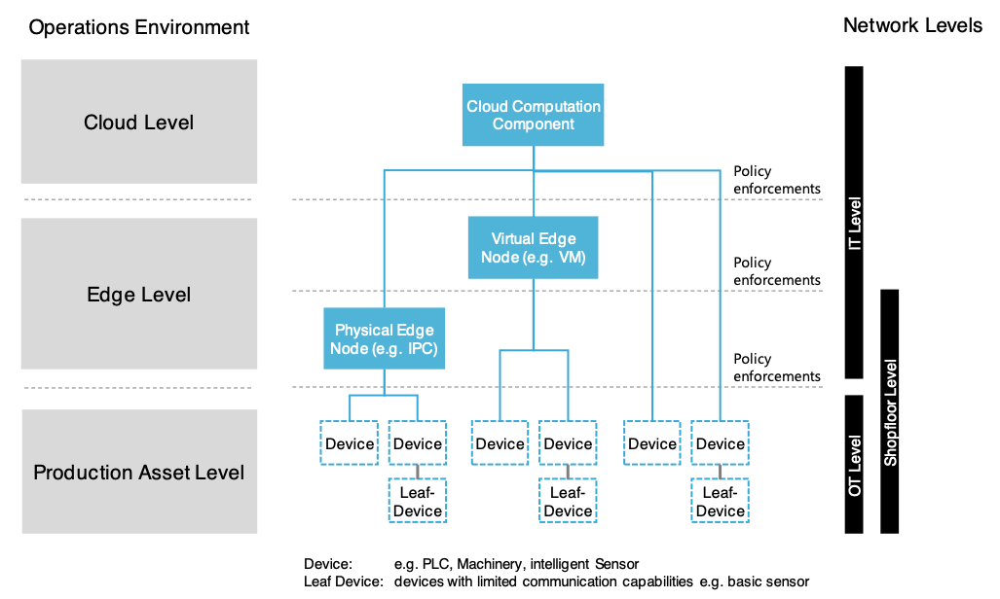

[< Chapter 1: Manufacturing at an Inflection Point](01_Manufacturing_at_an_Inflection_Point.md)

## 2 Breadth and Depth
### 2.1 Industrial IoT Challenges
The Industrial Internet of Things (IIoT), as applied to manufacturing, has a different scale and time criticality than some other IoT platforms used in residential, fleets, or other non-industrial scenarios. Lower intensity use cases typically handle millions of devices that are all connected and sending relatively infrequent data. In general, relatively modest amounts of data accumulate in these systems, and messages (often less than 1KB) are sent at relatively infrequent intervals. For example, a smart temperature meter doesn’t need to publish the current temperature every second because it remains constant over such a short timeframe. Similarly, in car fleet management, it is not required to send data such as position or average speed every minute because the use case does not need it. This would be a waste of resources such as power, computing capacity, or data storage. Manufacturing, however, can be much larger in scale and scope. 

Industrial IoT devices have critical real-time needs for repeatability and high availability. An example is an AI model that optimizes the parameters of a bending machine based on the current air temperature and humidity. Possible connection failures or high latencies can lead to stopped or interrupted processes or products with insufficient quality.

Manufacturing has a broad range of throughput requirements from low bandwidth for simple sensors using small packets to much higher bandwidth required for streaming data for video analytics, vibration sensors, or AR/VR visualization.  A holistic connectivity solution needs to be considered up-front to address this complexity successfully, spanning from the individual devices on the shop floor up through edge gateways and servers to the central data center or cloud resources such as compute and storage.

### 2.2 Network Levels
Networks are mostly customized to their precise environment and the desired function, and therefore can be very complex. For the purposes of this discussion, we will consider a system with three logical levels:

* The cloud level describes globally available and scalable compute, storage, and other services running in a public cloud. It is remote from the production site.
* The edge level extends the cloud capabilities geographically closer to OT devices. It’s an on-premise network that possesses a path to the cloud as well as to the Sensor/Actuator level. Edge nodes that can run universal workloads are typically located at that level. These are often hosted on industrial PCs (IPC) and compute devices, virtual machines in a data center, or an on-premise Kubernetes cluster.
* The production asset level is the network level where the OT assets are located, which capture the real-world processes (e.g., robots, cameras, machines) and react to them.

 

<b>
<figure>
	
	<figcaption>Figure 1: Industrial IoT architectures typically comprise out of a production asset level, edge level and cloud level.</figcaption>
</figure>
</b>

 

Equipment maintenance staffs operate on the shop floor level, which is comprised of the production asset level (OT) and physical edge nodes on the edge level, e.g., IPCs.

By deploying workloads on the edge level close to the data sources, the following benefits to IIoT arise:

* Security and data sovereignty - By processing data locally, data doesn’t need to be sent over the public Internet, potentially increasing security and enabling easier compliance with data sovereignty laws.
* Reduced latency - Local data processing increases response time and helps with reducing the latency for control loop tasks.
* Minimized bandwidth consumption - For high throughput use cases, like processing video feeds, it is often not feasible to send all data to the cloud for processing. Preprocessing, like filtering, can be done in this layer.
* Buffering - Data can be locally buffered if outages in later network layers occur.
* Equipment connection - Additional hardware components (e.g., cameras, sensors), even if not Internet ready, can be connected to the cloud.
* Process decoupling – Closed-loop operations are fully executed on the local device without dependencies on the broader network infrastructure

Depending on the given IT infrastructure, governance, or the kind of manufacturing, the production asset level could also be an aggregation of multiple network layers. For example, the Purdue network model was adopted to be a part of the ISA-95 (International Society of Automation) security standard, where an automation/control layer and additional layers are defined.

Securing the different layers of a given network is a complex business. Here are some example rules to potentially implement:

* Prevent a higher network level from accessing a lower level 
* Explicitly grant access to the immediate one level lower network layer 
* Prevent access to network layers that are not adjacent 
* Ensure access only for well-known resources
* Setup an in-depth defense to prevent a breached layer from spreading to the others.

Scenarios where OT assets directly communicate with the cloud (e.g., via 4G/5G over the air networks) are often restricted due to security governance rules and require additional corporate government efforts. This scenario is also a viable architectural pattern for remote production sites, especially if an industrial PC is utilized.

[Chapter 3: Principles for a Successful Connectivity Solution >](03_Principles_for_a_Successful_Connectivity_Solution.md)
