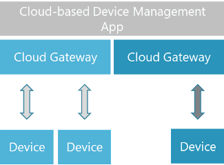

[< Chapter 5.4: Implementation - Interface btw. Production Asset & Edge Levels](05d_Implementation_InterfaceProdEdge.md)

## 5 Implementation
### 5.5	The interface between Edge and Cloud
Conveying data from the edge into the cloud via a streaming approach helps leverage independent cloud providers and drives a modular approach. Standardization takes place at the edge, and upstream computing can then be modularized to leverage best-in-class technology and capabilities. Plain MQTT or AMQP (Advanced Message Queuing Protocol) could be used, but a more forward-looking approach is OPC UA pub/sub. Standardization takes place at the edge, and upstream computing can then be modularized to leverage best-in-class technology and capabilities. OPC UA pub/sub, in contrast to plain MQTT or AMQP, does not require any transformation and therefore it is seen as the most promising candidate. Given the availability on this level, OPC UA pub/sub, which can use, for example, MQTT or AMQP, is the first choice for telemetry data because of the standardization, availability at the edge, and serialization capabilities.

With telemetry using OPC UA pub/sub, the edge provides an OPC UA publisher interface that can connect to one or more cloud-side MQTT/AMQP broker. In this case, clients connect to the MQTT/AMQP broker and consume messages. It is also possible to use a broker-less publisher-subscriber direct connection (using datagram protocols as UDP for transport).

If control from asset level to edge level is required, it is preferable that the edge level has an OPC UA server interface. If not possible, an approach where the asset sets values in its OPC UA server and the edge device (as an OPC UA Client) reacts on it is also feasible. The client needs to be notified as changes occur, e.g., by subscriptions or registered reads. For example, a data threshold for a machine learning model can be set on the server-side (asset). The client (edge) pulls these values and feeds the new threshold into its model; thus, the server indirectly controls the client by telemetry.

The predominant category of communication from cloud to edge is either command or managerial. Telemetry is not typically passed in this direction. The drivers of the data are the functions, logic, and intelligence applied in the cloud, which is then translated into command and management data to be passed down into the edge layer. The communication typically results in an action, either within the edge device or production assets. For example, parameters such as filters, logic, frequency, or timing could be altered based upon the learnings in the cloud.

 
<b>
<figure>
	
	<figcaption> Figure 4: Cloud-based Device Management App</figcaption>
</figure>
</b>
 
 

For example, as depicted in Figure 4, a device management solution provides management capabilities for edge devices. There are three edge devices from two different vendors that require specific communication. In order to abstract the device management solution away from the proprietary devices, the cloud gateways provide an open unified interface to control the edge devices. Examples of typical commands include start, stop, update firmware, renewal of certificates, download files as a trained machine learning model, and upload files.

The open interface receives commands from cloud applications while the propriety channel enables communication down to specific edge devices. The advantage of an open interface is that it is interoperable with any public cloud provider utilizing standard compute resources or cloud services. For the same reason, an edge container, enabling proprietary communication, should have an open interface to manage the connection settings.

[Chapter 6: Conclusion >](06_Conclusion.md)
